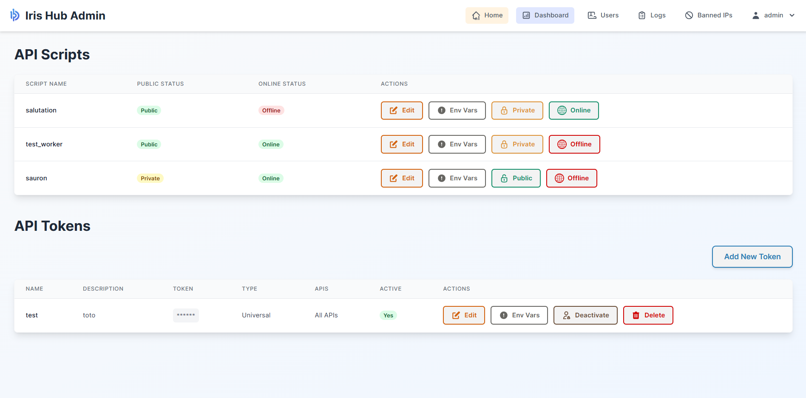

<p align="center">
  
</p>

# Iris

Ce projet est un worker d'API conçu pour gérer diverses requêtes API, traiter des données et interagir avec des services externes. Il offre une solution robuste et évolutive pour la gestion des flux de travail API.

## Fonctionnalités

*   **Gestion des requêtes API** : Traite efficacement les requêtes API entrantes.
*   **Traitement des données** : Inclut des modules pour la manipulation et la transformation des données.
*   **Intégration de services externes** : Conçu pour interagir de manière transparente avec diverses API et services externes.
*   **Évolutivité** : Conçu pour être évolutif afin de gérer des charges croissantes.
*   **Gestion des erreurs** : Gestion robuste des erreurs pour assurer la stabilité de l'application.
*   **Journalisation** : Système de journalisation complet pour la surveillance et le débogage.
*   **Authentification et Autorisation** : Authentification sécurisée des utilisateurs et gestion des jetons API.
*   **Panneau d'administration** : Interface web pour la gestion des utilisateurs, des jetons API et la consultation des journaux.

## Technologies Utilisées

*   **Backend** : Python, Flask (waitress en mode prod)
*   **Base de données** : SQLite (par défaut, configurable)
*   **Frontend** : HTML, CSS, JavaScript
*   **Authentification** : Système interne
*   **Sécurité** : Système interne de Fail2Ban

## Configuration et Installation

Suivez ces étapes pour configurer et exécuter l'Iris localement : 

1.  **Cloner le dépôt** :
    ```bash
    git clone https://github.com/zephyroff/iris.git
    cd iris
    ```

2.  **Créer un environnement virtuel** (recommandé) :
    Assurez-vous d'avoir Python 3.8+ installé.
    ```bash
    python -m venv venv
    ```

3.  **Activer l'environnement virtuel** :
    *   **Windows** :
        ```bash
        .\venv\Scripts\activate
        ```
    *   **macOS/Linux** :
        ```bash
        source venv/bin/activate
        ```

4.  **Installer les dépendances** :
    ```bash
    pip install -r requirements.txt
    ```

## Configuration

L'application utilise un fichier `settings.yaml` pour la configuration. Vous pouvez modifier ce fichier pour l'adapter à votre environnement.

**Structure du fichier `settings.yaml` :**

```yaml
server:
  host: 127.0.0.1 # Adresse IP sur laquelle le serveur écoutera
  port: 5000      # Port sur lequel le serveur écoutera

  template_dir: templates # Répertoire des modèles HTML
  static_dir: static      # Répertoire des fichiers statiques (CSS, JS, images)


secret_key: your_super_secret_key_here # Clé secrète pour la sécurité des sessions Flask.
                                       # CRITIQUE - Changez cette valeur en production.

app:
  mode: dev    # Mode de l'application (par exemple, 'dev' pour développement, 'prod' pour production)
  debug: False # Active/désactive le mode débogage de Flask. Définir à False en production.

  auth: True   # Active/désactive le système d'authentification
  admin: True  # Active/désactive le panneau d'administration
  home: True   # Active/désactive la page d'accueil

auto_protect:
  enable: True     # Active/désactive le système de protection automatique (Fail2Ban-like)
  blacklist: "null" # Liste noire d'adresses IP (sous forme de liste)
  whitelist: "null" # Liste blanche d'adresses IP (sous forme de liste)
  max_fail: 5      # Nombre maximal d'échecs avant bannissement
  fail_interval: 300 # Intervalle de temps (en secondes) pour compter les échecs
  ban_time: 300    # Durée du bannissement (en secondes)

database:
  engine: sqlite    # Moteur de base de données (actuellement 'sqlite' supporté)
  filename: app.db  # Nom du fichier de base de données SQLite
```

## Initialisation de la Base de Données

L'application utilise SQLite. Le fichier de base de données (`instance/hub.db` par défaut) sera créé automatiquement lors de la première exécution s'il n'existe pas. Aucune étape de migration explicite n'est généralement requise pour la configuration initiale avec SQLite, car `models/database.py` gère la création des tables.

## Exécution de l'Application

Pour démarrer le serveur de développement Flask :

```bash
python app.py
```

L'application s'exécutera généralement sur `http://127.0.0.1:5000`.

## Points d'API

Les points d'API sont définis dans `views/api_views.py` et sont accessibles via le préfixe `/api/<nom_du_script>`.

Les scripts d'API sont à ajouter dans le répertoire fabric. Pour les rendre compatible avec l'application, il faudrait ajouter le decorateur interne pour définir le point d'entrée de l'API/
Par exemple:

```python
from core.decorator import entrypoint

@entrypoint
def saluer(nom: str, titre: str="Monsieur/Madame"):
    """
    Retourne un message de salutation personnalisé.
    """
    return {"message": f"Bonjour {titre} {nom} !"}
```

**Authentification des API :**

Les scripts API peuvent être configurés comme `public` ou `non-public` via le panneau d'administration.

*   **Scripts Publics** : Ne nécessitent aucune authentification.
*   **Scripts Non-Publics** : Nécessitent une authentification via un jeton API valide.

Pour les scripts non-publics, les requêtes API doivent inclure un jeton dans l'en-tête `Authorization` au format `Bearer <votre_jeton_api>`.

**Types de jetons API :**

*   **Jeton d'application (`app` type)** : Ce jeton est lié à des scripts API spécifiques. Il ne peut accéder qu'aux scripts pour lesquels il a été explicitement autorisé via le panneau d'administration.
*   **Jeton universel (`universal` type)** : Ce jeton a accès à tous les scripts API non-publics.

**Exemple d'en-tête d'authentification :**
```
Authorization: Bearer VOTRE_JETON_API_ICI
```

**Exemple de point d'API : `/api/salutation`**

*   **GET /api/salutation** : Renvoie un message de salutation.
    *   **Réponse** : `{"message": "Bonjour depuis Iris !"}`

*   **POST /api/salutation** : Accepte un nom et renvoie une salutation personnalisée.
    *   **Corps de la requête (JSON)** :
        ```json
        {
            "name": "John Doe"
        }
        ```
    *   **Réponse** : `{"message": "Bonjour, John Doe !"}`

*(Une documentation API plus détaillée serait généralement générée ou fournie séparément pour une API de production.)*

## Variables d'Environnement pour les Scripts et les Jetons API

Iris permet de définir des variables d'environnement spécifiques pour chaque script API et chaque jeton API. Ces variables sont accessibles au moment de l'exécution du script via le contexte de l'environnement.

### Définition des Variables d'Environnement

Les variables d'environnement peuvent être définies via le panneau d'administration :

*   **Pour les Scripts API** : Dans la section "API Scripts", cliquez sur le bouton "Env Vars" à côté du script souhaité.
*   **Pour les Jetons API** : Dans la section "API Tokens", cliquez sur le bouton "Env Vars" à côté du jeton souhaité.

Une modale s'ouvrira, vous permettant d'ajouter, de modifier ou de supprimer des paires clé-valeur. Ces variables seront stockées sous forme de JSON dans la base de données.

### Accès aux Variables d'Environnement dans un Script API

Dans votre script API (fichier `.py` dans le répertoire `fabric/`), vous pouvez récupérer l'instance de l'environnement actuel et accéder à ces variables.

L'instance de l'environnement (`api_context`) contient les variables d'environnement définies pour le script *et* pour le jeton utilisé, avec les variables du jeton ayant priorité en cas de conflit de clés.

```python
from core.decorator import entrypoint
from core.environment_manager import get_environment

@entrypoint
def mon_script_api(param1, param2):
    # Récupérer l'instance de l'environnement
    api_context = get_environment()

    # Accéder aux variables d'environnement
    # api_context.environment_vars est un dictionnaire
    ma_variable_script = api_context.script_environment_vars.get("MA_VARIABLE_SCRIPT", "valeur_par_defaut_script")
    ma_variable_token = api_context.token_environment_vars.get("MA_VARIABLE_TOKEN", "valeur_par_defaut_token")

    # Exemple d'utilisation
    message = f"Script exécuté avec: {param1}, {param2}. " \
              f"Variable script: {ma_variable_script}. " \
              f"Variable token: {ma_variable_token}."

    # Vous pouvez aussi accéder à d'autres informations du contexte API
    # par exemple, les détails de la requête HTTP
    # request_method = api_context.request.method
    # request_path = api_context.request.path

    return {"status": "success", "message": message}
```

`script_environment_vars` permet d'accéder aux variables configurées au niveau de l'api

`token_environment_vars` permet d'accéder aux variables configurées au niveau du token

`token` permet d'accéder au token utilisé

`username` permet d'accéder au nom d'utilisateur si celui-ci est connecté


## Panneau d'Administration

<p align="center">
  
</p>

Le panneau d'administration fournit une interface web complète pour gérer l'application. Il est accessible à l'adresse `/admin` et nécessite une connexion utilisateur.

**Identifiants par défaut (à modifier via le panneau d'administration après la première connexion) :**
*   Nom d'utilisateur : `admin`
*   Mot de passe : `password`

### Pages et Fonctionnalités du Panneau d'Administration

*   **Tableau de Bord (`/admin`)** :
    *   Aperçu général de l'état du système.
    *   Fournit un accès rapide aux principales sections de gestion.

*   **Gestion des Utilisateurs ** :
    *   **Création d'utilisateurs** : Ajouter de nouveaux comptes utilisateurs avec des rôles spécifiques (admin/utilisateur).
    *   **Modification d'utilisateurs** : Mettre à jour les informations des utilisateurs existants, y compris le nom d'utilisateur, l'e-mail, le rôle et les permissions d'accès aux API.
    *   **Suppression d'utilisateurs** : Retirer des comptes utilisateurs du système.
    *   **Activation/Désactivation** : Contrôler l'état actif des comptes utilisateurs.

*   **Gestion des Jetons API (section Tokens)** :
    *   **Création de jetons** : Générer de nouveaux jetons API (de type `app` ou `universal`).
    *   **Modification de jetons** : Mettre à jour la description, l'état d'activité et les permissions des jetons existants.
    *   **Variables d'Environnement des Jetons** : Définir des paires clé-valeur spécifiques à chaque jeton, accessibles dans les scripts API.
    *   **Activation/Désactivation** : Contrôler l'état actif des jetons API.
    *   **Suppression de jetons** : Retirer des jetons API du système.

*   **Gestion des Scripts API (section Scripts)** :
    *   **Visibilité** : Définir si un script est `public` (accessible sans jeton) ou `non-public` (nécessite un jeton).
    *   **État en ligne** : Activer ou désactiver un script API, le rendant disponible ou non pour les requêtes.
    *   **Variables d'Environnement des Scripts** : Définir des paires clé-valeur spécifiques à chaque script, accessibles dans les scripts API.

*   **Visionneuse de Journaux** :
    *   Consulter les journaux d'activité de l'application, classés par type (système, web, API, socket).
    *   Permet de filtrer les journaux pour faciliter le débogage et la surveillance.

*   **Gestion des Adresses IP Bannies** :
    *   Consulter la liste des adresses IP actuellement bannies par le système `auto_protect`.
    *   Permet de dé-bannir manuellement des adresses IP.

## Structure du Projet

*   `app.py` : Le point d'entrée principal de l'application Flask.
*   `requirements.txt` : Liste toutes les dépendances Python.
*   `settings.yaml` : Fichier de configuration de l'application.
*   `core/` : Contient la logique principale de l'application telle que l'authentification, la configuration, la gestion des erreurs, la journalisation et les décorateurs.
*   `fabric/` : Contient les scripts API exécutables par le worker (par exemple, `salutation.py`, `test_worker.py`).
*   `instance/` : Stocke les données spécifiques à l'instance, y compris la base de données SQLite (`hub.db`).
*   `models/` : Définit les modèles de base de données et les interactions (`database.py`).
*   `static/` : Actifs statiques comme les CSS, JavaScript et les images.
*   `templates/` : Modèles HTML pour le rendu des pages web, y compris les modèles du panneau d'administration.
*   `views/` : Définit les blueprints et les routes Flask pour différentes parties de l'application (par exemple, `api_views.py` pour l'API, `admin_views.py` pour le panneau d'administration, `views.py` pour les pages web générales).
